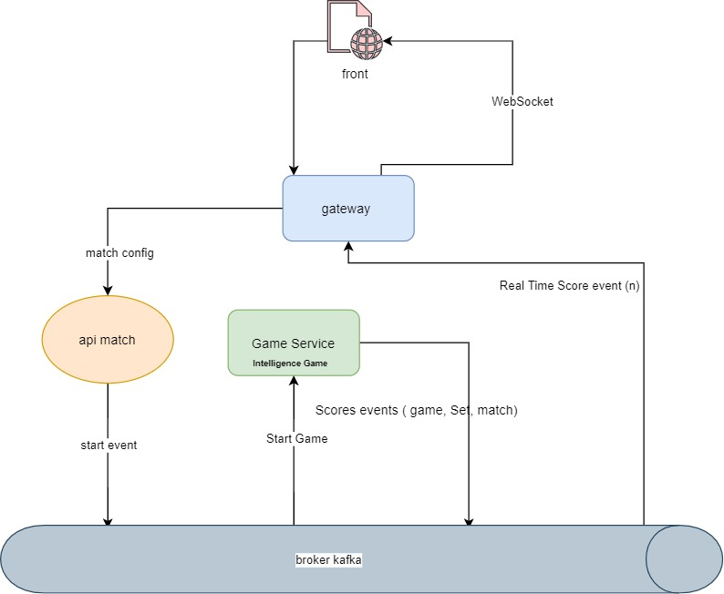

# tennis-kata

### How to use
### for Tennis-kata application
> use environment variables as MATCH_SERVICE_ENDPOINT=localhost:8082;KAFKA_HOST=localhost;KAFKA_TOPIC=GAME_TOPIC;KAFKA_GROUP=MONITORING
> you have a Dockerfile if you use docker
>
# front end

## Available Scripts

In the ui directory, you can run:

### `npm start`

Runs the app in the development mode. 
Open [http://localhost:3000](http://localhost:3000) to view it in the browser.

The page will reload if you make edits. 
You will also see any lint errors in the console.

### `npm test`

Launches the test runner in the interactive watch mode. 
See the section about [running tests](https://facebook.github.io/create-react-app/docs/running-tests) for more information.

### `npm run build`